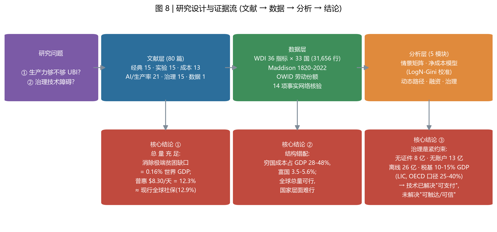
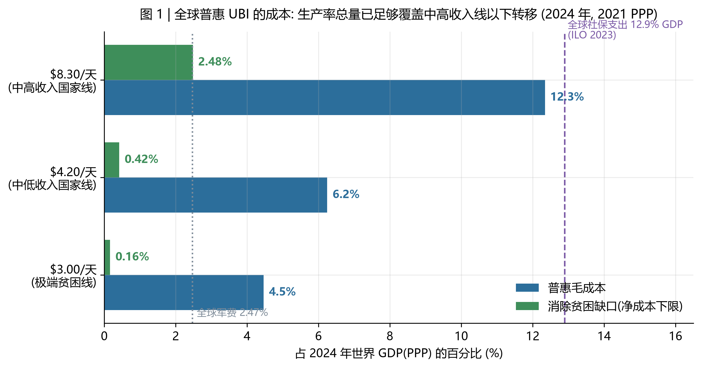
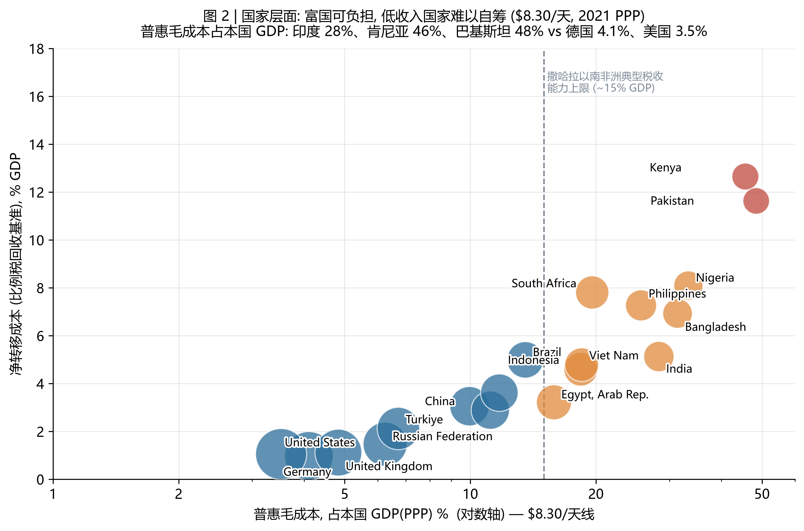
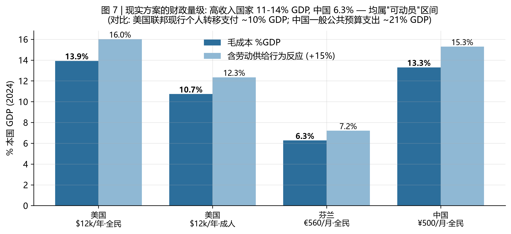
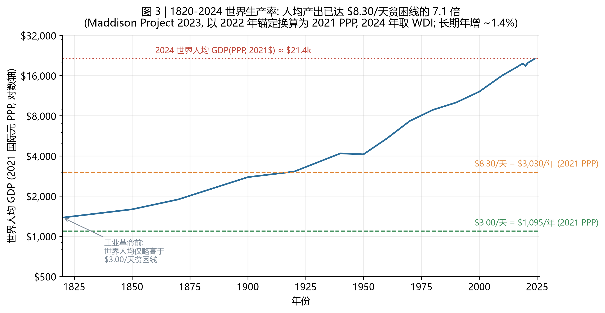
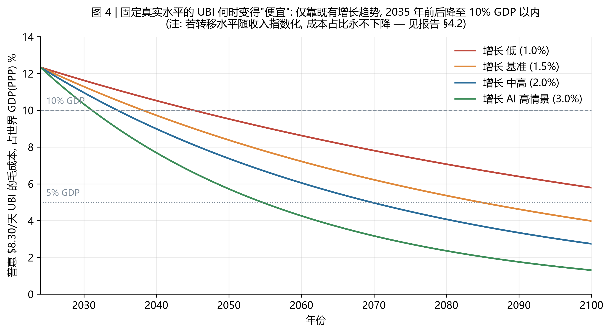
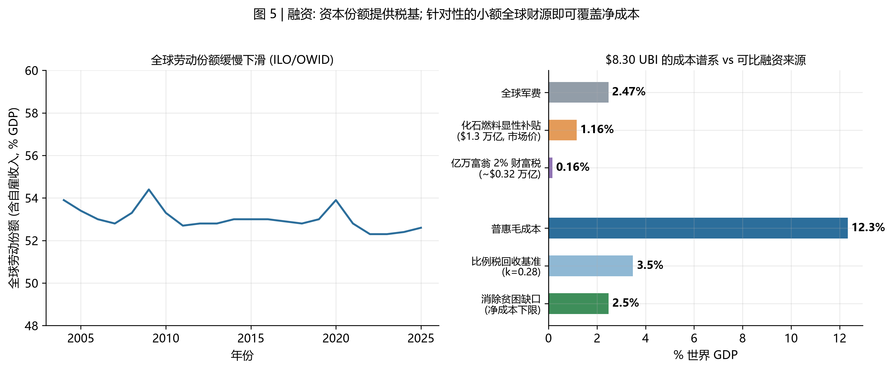
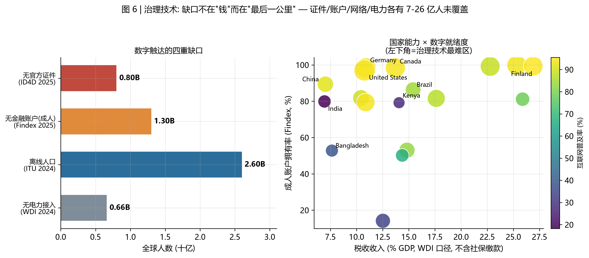

# 人类的生产力足够 UBI 了吗？——基于 80 篇文献与 31,656 条世界银行观测的系统分析

**研究日期**：2026-09-04 ｜ **数据截至**：世界银行 WDI 2024 年值（2026-07 版数据库）｜ **代码与数据**：本目录 `scripts/`、`data/`、`sources/`，全程可复现

---

## 摘要

**两个问题的答案：**

**① 生产力够不够？——总量上早就够了，结构上还不够，且"随收入水涨船高"的 UBI 永远不会被生产率增长自动"变便宜"。**

- 以 2021 PPP 世界银行贫困线衡量：把每一个贫困人口的收入补到 **$3.00/天（极端贫困线）**，全球净成本仅 **0.32 万亿美元 = 0.16% 的世界 GDP**；补到 **$8.30/天（中高收入国家线）**，净成本 **4.96 万亿 = 2.48% 世界 GDP**（世界银行贫困缺口指数 × 人口，2024 年）。
- **普惠**（不定向、人人可领）发放 $3.00/天 的**毛成本**为 8.91 万亿 = **4.5% 世界 GDP**；$8.30/天 为 24.66 万亿 = **12.3%**——与全球现行社会保障总支出（12.9% GDP，ILO）几乎完全相当。也就是说，**人类今天已有的生产率足以支付一份"中高收入贫困线水平"的全球全民分红，规模等于现存社保体系**；问题在于这笔钱目前几乎全部花在高收入国家内部。
- 国家账本截然不同：$8.30/天 普惠毛成本占本国 GDP——美国 3.5%、德国 4.1%、中国 11.2%、印度 28.3%、肯尼亚 45.6%、巴基斯坦 48.4%。**低收入国家在可预见的税基下无法自筹，"全球可行"不等于"国家可行"。**
- 动态视角：世界人均产出从 1820 年的约 $1,130（2011$）增至 2024 年的约 $24,500（2021 PPP），长期年均增长 ~1.4%。仅靠既有增长趋势（2010-2024 年均 2.07%），固定水平的 $8.30/天 UBI 成本占比将在 **2031-2045 年间降至 10% 以内**（取决于增长情景）；但若转移水平按人均收入指数化，成本占比是一个恒等式（= 水平/人均收入），**任何增长率都无法降低它**——AI 高情景（年均 3%）也只把 5% 门槛从约 2070 年提前到约 2055 年。

**② 治理技术上的阻碍？——支付技术正在快速收敛，真正的瓶颈是"身份-账户-国家能力-可信度"四层基础设施与政治可持续性。**

- 触达缺口：全球约 **8 亿人无官方证件**（World Bank ID4D 2025）、**13 亿成年人无金融账户**（Global Findex 2025）、**26 亿人离线**（ITU 2024）、约 **6.6 亿人无电力**（WDI 2024）。至少一个维度缺失者在 26-42 亿人之间（视相关结构假设）。
- 国家能力缺口：低收入国家税收收入普遍仅占 GDP 10-15%（OECD 全口径高收入国家为 25-40%），ILO 估算低收入国家补齐社保覆盖每年需追加 **3,085 亿美元**。
- 可信度缺口：规模化的身份-支付系统在准确性与排斥性之间权衡——印度 Aadhaar 生物识别认证在贾坎德邦造成 **2-6% 合格受益人被系统性排除**且未减少虚假领取；美国疫情期失业保险 **11-15%（1,000-1,350 亿美元）涉嫌欺诈**。定向与普惠的取舍存在经典的"悖论"：越定向，政治联盟越窄、总额越小（Korpi-Palme 悖论），且定向本身有高信息与排斥成本（Hanna-Olken）。
- 政治可持续性：瑞士 2016 年公投以 **76.9% 否决**；安大略省新政府上台即取消试点；美国最大规模 OpenResearch 三年实验显示就业率小幅下降（72% vs 74%），中期政治可行性存疑。

**一句话结论**：生产率不是 UBI 的紧约束——它在全球总量层面早已越过一个世纪前 UBI 倡议者（Milner、Meade、George）无法想象的门槛；**紧约束是分配的政治学（钱从谁身上来）与治理的工程学（钱能不能准确、可申诉、可持续地到人）**。

---

## 1. 研究问题与判定框架

"生产力足够 UBI 了吗"不是一个有单一答案的问题，取决于四个口径选择。本文把它们拆成可分别检验的子命题：

| 维度 | 口径 A | 口径 B |
|---|---|---|
| **总额 vs 净额** | 普惠毛成本（人人可领的支出总额） | 净成本（贫困缺口下限 / 累进回收后的真实转移） |
| **全球 vs 国家** | 世界统一账本 | 各国自筹能力 |
| **固定 vs 相对** | 固定真实水平的转移（$X/天） | 随收入指数化的转移（α×人均收入） |
| **静态 vs 动态** | 2024 年快照 | 增长路径 + AI 情景下何时可负担 |

方法流程（图 8）：五主题文献综述（经典理论 / 实验证据 / 成本融资 / AI 与生产率 / 治理技术）→ 世界银行 WDI 36 项指标 × 33 国（31,656 行）+ Maddison 1820-2022 长期序列 + ILO/OWID 数据 + 14 项关键事实的网络逐条核验（见 `sources/facts_verified.md`）→ 五模块定量分析（`scripts/06_analysis.py`）。



**图 8 ｜ 研究设计与证据流**

---

## 2. 文献综述要点

完整文献库（80 条，57 条经 OpenAlex 逐条核验元数据）见文末附录与 [sources/references.md](sources/references.md)。

### 2.1 经典理论：UBI 从一开始就是一个"生产率红利"命题

- **Friedman（1962）**负所得税确立了"现金优于实物管制"的现代基调；**Tobin 等（1967）**在耶鲁法学期刊上首次系统核算负所得税的财政可行性。
- 1920 年代英国工程师 **Milner 兄弟**的"国民产出红利"与 **George（1879）**的土地红利、**Meade（1972）**的社会分红，本质上都是同一个命题：**当平均产出超过生存线足够多时，社会可以把"增长的利息"按人头分红**。本文第 3 节表明，这个"利息"在全球总量层面已经大到足以覆盖 UMIC 线的普惠转移。
- **Van Parijs（1995；2017）**给出规范性基础（真实自由/maximin）与欧盟尺度方案；**Atkinson（1995；1996；2015）**提出参与收入以回应"不劳而获"质疑；**Piketty（2014）**与 **Piketty-Zucman（2014）**证明财富/收入比已回到 19 世纪水平，为资本税融资提供了核算基础；**Zucman（2019）**估算全球财富分配的极端集中度。

### 2.2 实验证据：现金不显著减少工作，这是文献中最稳健的结论

| 研究 | 设计 | 劳动供给结果 | 其他 |
|---|---|---|---|
| 阿拉斯加永久基金（Jones & Marinescu） | 全民、永久、石油红利（1982-） | **就业无影响；兼职 +1.8pp（+17%）** | 唯一"准全民 UBI"自然实验 |
| 加拿大 Mincome（Forget 2011） | 保障年收入试点（1974-79） | 劳动供给小幅下降（主要为学生/母亲） | 住院率 -8.5% |
| 芬兰 Kela（2017-18） | 2,000 名失业者，€560/月 | **就业天数 +6 天**（第二年 78 vs 72） | 福祉/心理健康显著改善〔Kela 2020〕 |
| 肯尼亚 GiveDirectly（Egger et al. 2022） | 653 村、10,500 户、~$1,000/户 | 村级财政乘数 **2.4-2.6**；物价仅微升 | 非受助户同样受益；2024 Frisch 奖 |
| 伊朗全国现金转移（Salehi-Isfahani et al. 2018） | 全国、相当于收入 ~29% | **无负向就业效应** | 唯一全国规模自然实验之一 |
| Stockton SEED（West et al. 2021） | $500/月，125 人 | 全职就业 +12pp | 受助者福祉改善 |
| OpenResearch 美国（2024） | **$1,000/月 × 3 年，N=3,000** | 周工时 **-1.3~1.4h**；第 3 年就业率 72% vs 74%；不含转移的家庭收入 -5% | 规模最大、最严格的美国实验 |
| 儿童税收抵免 2021（美国） | 近普惠月度现金 | 到期后就业未出现显著"回升" | 儿童贫困 5.2%→12.4%（到期后） |
| 系统综述（Banerjee et al. 2017；Pega et al. 2017） | 现金转移劳动供给元证据 | **无系统性"变懒"效应** | Cochrane 级证据 |

**综合判断**：中低收入环境与永久性转移下，劳动供给效应≈0；高收入环境的大额转移存在小幅负效应（OpenResearch 的 -1.3h/周、收入 -5%）。这为融资测算提供行为参数：按毛成本 +15% 计入行为反应是偏保守的（图 7）。

### 2.3 成本核算：从"吓人的毛成本"到"真实的净成本"

- **Widerquist（2017）**澄清了 UBI 成本的三种口径：毛支出、净转移（扣回收）、增量（相对现状），三者可差一个数量级。本文第 3 节的"成本谱系"即按此构建。
- **OECD（2017）**静态微观模拟显示北欧式 UBI 需 ~12% GDP 且减贫效率低于现行体系；**Hoynes & Rothstein（2019）**系统指出美国 $12k 方案毛成本 ~14% GDP，须与现行体系比较而非与零比较。
- **Hanna & Olken（2018）**与 **Coady & Prady（IMF 2018）**在发展中国家语境下比较普惠与定向：普惠在能力弱的国家更可取，但预算约束决定了"普惠水平必然低"。
- **Korpi & Palme（1998）**的"再分配悖论"（定向越多、再分配总额越小）与 **Nikiforos 等（2017，Levy 模型）**的宏观乘数模拟构成本文成本谱系的理论两端。

### 2.4 自动化与 AI：从"就业末日"到"任务互补"，叙事已经反转过一次

- 第一代叙事：**Frey & Osborne（2017）**估计 47% 美国岗位"高风险"（被引 8,557，该领域引用最高的论文）。
- 修正：**Arntz et al.（2016, OECD）**按任务法重估仅 **9%** 岗位高风险；**Autor（2015）**强调历史上一贯的任务互补。
- 机器人实证：**Acemoglu & Restrepo（2020, JPE）**每千工人多一台机器人使当地就业人口比 -0.2pp、工资 -0.42%；**Graetz & Michaels（2018）**发现机器人提高生产率但未减少总就业；**Acemoglu & Restrepo（2019）**的"自动化 vs 新任务"框架与 **Acemoglu et al.（2022）**职位空缺证据表明 AI 当前更多是替代性任务集中。
- **分配后果**先于总量后果：全球劳动份额自 1980 年代下降约 5pp（Karabarbounis & Neiman 2014），美国超级明星企业集中推低劳动份额（Autor et al. 2020），净资本份额近乎翻倍（Barkai 2020）——这正是 UBI 议题回到议程核心的宏观背景。
- **LLM 时代的宏观量级之争（2023-2025 前沿）**：
  - 保守端：**Acemoglu（2024/2025）**任务核算给出 10 年 TFP 仅 **+0.66%**、GDP +0.93~1.16%，因 AI 可及任务仅占增加值 ~5%；
  - 乐观端：**Goldman Sachs（Briggs & Kodnani 2023）**估计 10 年全球 GDP **+7%**、生产率 +1.5pp/年；
  - 微观实证介于其间：呼叫中心 +14-15%（Brynjolfsson et al., QJE 2025）、写作任务快 37%（Noy & Zhang, Science 2023）、编码任务快 56%（Peng et al. 2023）、咨询任务质量 +40%（Dell'Acqua et al. 2023）；**Eloundou et al.（2024, Science）**估计 80% 美国劳动力至少 10% 任务暴露于 LLM；**IMF（Cazzaniga et al. 2024）**估计全球 40%（发达经济体 60%）就业暴露。
  - 本文的动态测算（第 3.4 节）把两端都作为情景处理，结论对两端都稳健：**即便乐观情景成立，AI 也不是"让 UBI 变便宜"的开关**（见 4.2 的恒等式）。

### 2.5 治理技术：从 ID 到申诉的"最后一公里"文献

- 身份：World Bank **ID4D**——8-8.5 亿人无官方证件、33 亿人无可用于官方交易的数字 ID（2025 版）。
- 金融：**Global Findex**——账户拥有率 2011→2025 从 51% 升至 **79%**，仍有 **13 亿**成年人无账户；**Suri & Jack（2016, Science）**：M-Pesa 使 2% 肯尼亚家庭脱贫。
- 排斥风险：**Drèze、Khera & Somanchi（2019）**的贾坎德邦 PDS 研究——生物识别认证造成 **2-6% 系统性排除**且未减少虚假领取；**Dixon（2017）**称 Aadhaar 是 "Do No Harm" 原则的失败案例。
- 定向技术的天花板：**Alatas et al.（2012, JPE）**证明代理 means testing 的错误率在数据最好的情况下仍很高；**Jean et al.（2016）/Blumenstock et al.（2015, Science）**与 **Aiken et al.（2022, Nature）**展示卫星/手机数据定向可部分弥补，但精度-公平权衡仍在。
- 国家能力：**Besley & Persson（2009；2011）**的财政能力积累框架；欺诈基准：美国疫情期 UI **11-15% 涉嫌欺诈**（GAO-23-106696）；泄漏治理证据：印度安得拉邦生物识别智能卡使泄漏显著下降（Muralidharan et al. 2016, AER）。

---

## 3. 定量分析结果

### 3.1 全球账本：总量早已充足



以 2024 年为快照（世界人口 81.4 亿，GDP(PPP) 199.8 万亿国际元）：

| 贫困线（2021 PPP） | 年转移额/人 | 普惠毛成本 | 占世界 GDP | 低于该线人口 | 消除缺口净成本 | 占世界 GDP |
|---|---|---|---|---|---|---|
| $3.00/天（极端线） | $1,095 | 8.91 万亿 | **4.5%** | 8.47 亿（10.4%） | 0.32 万亿 | **0.16%** |
| $4.20/天（LMIC 线） | $1,533 | 12.48 万亿 | **6.2%** | 15.39 亿（18.9%） | 0.84 万亿 | **0.42%** |
| $8.30/天（UMIC 线） | $3,030 | 24.66 万亿 | **12.3%** | 37.53 亿（46.1%） | 4.96 万亿 | **2.48%** |

三个对照锚点：全球现行社会保障支出 **12.9%** GDP（ILO，2023，不含医疗）；全球军费 **2.47%** GDP（≈4.9 万亿 PPP）；化石燃料显性补贴 **1.3 万亿美元**（IMF，2022，≈消除极端贫困线缺口成本的 4 倍）。

**读法一（净成本）**：把全人类补到 $8.30/天 只需全球 GDP 的 2.5%——比全球军费多一点。**读法二（毛成本）**：一份不问收入、人人可领的 $8.30/天 UBI 总额 ≈ 全球现有社保支出总额。**两个读法都指向"总量充足"**：这不是"未来才能负担"的事，而是"现在就能负担、但钱在别人预算里"的事。

PPP 口径说明：上表衡量的是**真实资源成本**（各国以本币自筹）。若设想由国际转移支付体系出资（例如全球税收池），以市场汇率计价的转移规模会更大，因为贫困国家内部价格水平更低——这正是"全球 UBI"与"各国 UBI"的本质区别。

### 3.2 国家账本：结构错配是核心矛盾



$8.30/天 普惠毛成本占本国 GDP（2024，逐指标最新年份）：

| 组别 | 国家（毛成本 % / 比例税净成本 %） |
|---|---|
| 高收入（轻松） | 美国 3.5/1.1 · 德国 4.1/1.0 · 芬兰 4.7/0.9 · 法国 4.8/1.1 · 英国 4.8/1.1 · 日本 5.6/1.3 · 加拿大 4.6/1.0 |
| 中上收入（吃力但可议） | 中国 11.2/2.9 · 墨西哥 11.7/3.6 · 巴西 13.5/5.0 · 土耳其 6.7/2.1 · 俄罗斯 6.2/1.5 · 南非 19.6/7.8 · 阿根廷 9.9/3.1 |
| 中低收入（不可自筹） | 印度 28.3/5.1 · 印尼 18.4/4.6 · 越南 18.5/4.8 · 菲律宾 25.6/7.3 · 埃及 15.8/3.2 |
| 低收入（完全不可） | 肯尼亚 45.6/12.7 · 尼日利亚 33.3/8.1 · 巴基斯坦 48.4/11.6 · 孟加拉 31.4/6.9 |

**关键事实**：低收入国家税收收入占 GDP 比重通常仅 10-15%（OECD 全口径高收入国家 25-40%），而 $3.00/天 的普惠毛成本在肯尼亚就占 GDP 的 16.5%、巴基斯坦 17.5%——**在自有税基内连极端贫困线的普惠发放都不可行**；消除缺口的净成本（肯尼亚 2.2%、尼日利亚 1.6%）则落在 ILO 估算的 3,085 亿美元/年全球缺口的同一量级。结论：对低收入国家，UBI 的可行性问题等价于**国际转移支付与全球融资工具**问题（外国援助占 GNI 比重、全球资源租金分红——阿拉斯加模式、碳价收入返还等），这本质是政治与制度工程，不是生产率问题。

### 3.3 现实方案对照：高收入国家 11-14% GDP，中国 6.3%



| 方案 | 年成本 | 占本国 GDP | 含 +15% 行为反应 |
|---|---|---|---|
| 美国 $12,000/年·全民（Hoynes-Rothstein 口径） | 4.08 万亿美元 | **13.9%** | 16.0% |
| 美国 $12,000/年·仅成年人 | 3.14 万亿美元 | 10.7% | 12.3% |
| 芬兰 €560/月·全民（Kela 金额外推） | 376 亿欧元 | **13.3%** | 15.3% |
| 中国 ¥500/月·全民 | 8.45 万亿元 | **6.3%** | 7.2% |

参照系：美国联邦现行个人转移支付 ~10% GDP；OECD 国家税收占 GDP 25-40%。**高收入国家的 UBI 属于"规模与现有社保相当的重构"，不是"天文数字"**；真正的财政问题不是生产率，而是替代/叠加哪些现行项目、以什么税种回收高收入者的净受益（净转移成本仅为毛成本的 28% 左右，见 3.5）。

### 3.4 动态路径：生产率增长何时把 UBI "变便宜"？



1820 年世界人均产出仅略高于 $3.00/天 贫困线的年化值；此后以年均 ~1.4% 复利增长，2024 年达到该贫困线的 8 倍、$8.30/天 线的 8.1 倍。**工业革命以来的生产率积累已经单方面越过了 UBI 的总量门槛**——这正是 Milner（1920）"国民产出红利"设想在一个世纪后的兑现条件。



但要注意一个**恒等式**：若 UBI 水平随收入指数化（B = α×人均收入），则毛成本/GDP ≡ α，与增长率无关。因此：

- **固定真实水平**的 $8.30/天 UBI：在 1.0%/1.5%/2.0%/3.0%（AI 高情景）增长路径下，成本占比从 12.3% 降至 10% 分别需要至 **2045 / 2038 / 2035 / 2031** 年；降至 5% 需至 **2115 / 2085 / 2070 / 2055** 年。
- **相对水平**（如"人均收入 25%"）的 UBI：**永远**占 GDP 的 25%——生产率增长不改变其相对成本，只提高其绝对规模。
- **AI 情景的量级**：Acemoglu（TFP 10 年 +0.66%）情景与基准路径几乎重合；Goldman Sachs（10 年 GDP +7%）情景大约把上述日程提前 10-15 年。**即便按乐观情景，AI 到 2050 年代中期才能把固定水平 UBI 的成本占比压到 5%——AI 是路径的斜率，不是门槛的开关。**

### 3.5 融资：成本谱系与资本份额



用对数正态分布（以各国 Gini 校准，世界 Gini≈0.39）参数化收入分布，可计算"普惠发放 + 比例税回收"下的**净转移成本**（Widerquist 意义上真正流向净受益者的钱）：

$$\text{净成本} = k(\text{Gini}) \times \text{毛成本}, \quad k = E[(1-Y/\mu)^+] \approx 0.28\ (\text{Gini}=0.39)$$

- **成本谱系**（以 $8.30/天 为例）：消除贫困缺口（完全定向回收的理论下限）**2.5%** GDP ←→ 比例税回收基准 **3.5%**（k 随 Gini 从 0.18 到 0.41：不平等越低、净成本越低）←→ 零回收的毛额 **12.3%**。**UBI 的财政负担主要取决于回收设计的累进程度，而不是发放本身。**
- **全球劳动份额**（含自雇，ILO/OWID）已降至 **52.4%**（2024），资本份额 ~47.6%：消除 $8.30 缺口若全部用资本收入税融资，有效税率仅 **5.2%**；普惠毛额则需 ~26%。资本收入税基的现实约束在跨境逃避（全球 ~8-10% 家庭金融财富藏于避税港，Zucman），而非不存在。
- **小额全球财源即够净成本**：Forbes 2025 亿万富翁财富 ~16.1 万亿美元，2% 年度财富税 ≈ **0.32 万亿** ≈ 恰好覆盖极端贫困线缺口（0.32 万亿）；化石燃料显性补贴（1.3 万亿）是缺口的 4.1 倍。**这些是政治选择菜单，不是生产率约束。**

### 3.6 治理技术：四重触达缺口与三层制度约束



**触达层（数字公共基础设施）**——全球缺失人数：

| 维度 | 缺口 | 来源与年份 |
|---|---|---|
| 官方证件 | **~8.0-8.5 亿** | World Bank ID4D（2025 版 8.0 亿；此前 8.5 亿） |
| 金融账户（成人） | **13 亿**（79% 已覆盖） | Global Findex 2025 |
| 互联网接入 | **26 亿**（高收入国 93% vs 低收入国 27%） | ITU Facts & Figures 2024（2025 修订 22-23 亿） |
| 电力 | **~6.6 亿**（91.9% 覆盖） | WDI 2024 |
| 数字证件（可用于官方交易） | **33 亿** | ID4D 2025 |

三个维度"至少缺一"的人口在 **26 亿（高相关情形）至 42 亿（独立假设上限）**之间。方向上令人乐观：账户覆盖十年内从 51% 升至 79%（Findex），印度 Aadhaar 覆盖 13.8 亿、巴西 Pix、移动货币在撒哈拉以南非洲的普及，说明**纯技术触达缺口在收敛**；收敛速度才是"什么时候能发"的真实时间表。

**能力层**：低收入国家税收占 GDP 10-15%（WDI 中央政府口径样本中 12/18 国 <15%；OECD 全口径高收入国家 25-40%）；ILO 估算低收入国家补齐社保覆盖需 3,085 亿美元/年。**没有税基，普惠即空谈；没有财政能力，定向也无钱可分**（Besley-Persson 框架）。

**可信层**（欺诈/泄漏/排斥三角）：
- 大规模给付必有欺诈-排斥权衡：美国疫情 UI 欺诈 11-15%（GAO）；印度 Aadhaar 反向案例——2-6% 合格者被排除且未减虚假领取。生物识别智能卡（安得拉邦）证明了泄漏可减半量级，但每一次"防欺诈升级"都产生新的排斥与隐私成本。
- 定向的信息悖论：Alatas 等证明即使数据最完善的代理 means testing 也有高错误率；卫星/手机大数据（Jean et al.；Aiken et al.）可提高精度，但制度化的申诉与纠错机制是文献中最被低估的组件。
- 政治可持续性：瑞士公投 76.9% 否决；安大略省 2018 年取消已运行的试点；阿拉斯加分红靠宪法信托基金而非年度预算才得以存续 40 余年——**UBI 的治理难点不是"发一次"，而是"永远发"**：需要与经济周期脱钩的融资工具（主权财富基金/资本税）与跨党派宪法化安排。

---

## 4. 结论

### 4.1 对问题一："人类的生产力足够 UBI 了吗？"

**分四层回答：**

1. **消除绝对贫困的层面——早就足够，且绰绰有余。** 净成本 0.16% 世界 GDP；任何"全球还不够富"的说法在这个层面都不成立。真正的问题是这 0.16% 的钱由谁出、怎么到人。
2. **全球普惠的层面——静态总量足够。** $8.30/天 普惠毛成本 ≈ 全球现行社保支出占比（12.3% vs 12.9%）。人类已经运行着一份"面向富国公民的准 UBI"，缺的是把它变成全球普惠的分配机制。
3. **国家自筹的层面——一半人类所在的国家不够。** 从印度（28%）到巴基斯坦（48%）到撒哈拉以南非洲，低收入国家的自有税基无法支撑哪怕贫困线水平的普惠发放。**生产率的全球总量充足性掩盖了国家间的巨大错配**；没有全球融资工具（全球资本税、资源租金分红、碳收入返还），UBI 在穷国只是纸面可行。
4. **"随收入增长而升级"的层面——永远不会自动够。** 指数化 UBI 的成本占比是恒等式。指望"AI 会让 UBI 变得便宜"在算术上不成立：AI 只能缩短固定水平 UBI 的"变便宜"时间表（乐观情景提前 10-15 年），无法降低相对型 UBI 的份额。**UBI 的规模之争永远是一场再分配政治斗争，而不是生产率问题。**

### 4.2 对问题二："治理技术上有什么阻碍？"

按约束的硬度排序：

1. **税收与财政能力（最硬约束）**：全球再分配缺一套"全球税基-全球支付"的宪制工具；穷国税基（10-15% GDP）撑不起任何有意义的人均水平。这属于政治经济学，但其技术载体（避税港数据交换、全球最低税、数字服务税）正在成形。
2. **身份-账户-接入的三重基础设施**：26-42 亿人至少缺一维。技术上收敛速度很快（账户十年 +28pp），工程上需要的是把 ID-支付-申诉打通的"数字公共基础设施"集成（印度 Stack/MOSIP/Pix 模式），而不是任何单点技术。
3. **可信给付的工程学**：欺诈-排斥-隐私三角没有免费解。Aadhaar（排斥）与美国 UI（欺诈）是同一枚硬币的两面；可申诉性（grievance redress）与降级方案（fallback）是文献中最被低估的设计要件。
4. **政治可持续性（最被低估）**：一次性发放容易，"永远发"需要与政治周期脱钩的融资（阿拉斯加模式）与跨代契约。OpenResearch 的就业负效应（-2pp）虽小，却足以在选举政治中被放大——**UBI 的最终约束在合法性，而不在算术**。

### 4.3 一段话总结

把 80 篇经典与前沿文献、31,656 条世界银行观测和 1820 年以来的长期生产率序列放在一起看：**人类在 2024 年的生产率足以给每个人发一份中高收入贫困线水平的全民分红，其净成本（~2.5% 全球 GDP）不到全球军费的一半；真正卡住 UBI 的，是"钱从富国纳税人身上来、到穷国人口手中去"的分配政治，以及"准确、可申诉、可持续地把钱送到 81 亿人手中"的治理工程。** 这两个约束都有明确的技术路径，但路径不等于路已修通——执行比想象中复杂：税制重构、身份与支付基础设施、养老金排队、政治共识，每一项都是以十年计的制度工程。生产力的问题，一百年前就已经答完了；剩下的是把答案变成现实的漫长工程。

---

## 5. 不确定性与局限

1. **收入分布为参数近似**：净转移成本用对数正态分布（Gini 校准）而非微观普查数据；该模型对人均收入水平尺度不变，但对分布形状敏感。方向性结论（净成本 ≈ 毛成本 × 0.2-0.4）与 Widerquist、IMF 的微观模拟一致。
2. **贫困线口径**：世界银行 2025 年 6 月起采用 2021 PPP（$3.00/$4.20/$8.30）；旧 $2.15（2017 PPP）口径下极端贫困人口 ~7 亿（8.5%）。本报告统一采用新线。PPP 衡量真实资源成本；国际融资视角需换市场汇率（报告正文已注）。
3. **WDI 税收口径**不含社会保障缴款且多为中央政府口径（美国 10.8%、加拿大 13.7% 即此原因）；跨国比较时引用 OECD 全口径数据。
4. **行为反应参数**（+15%）取自 OpenResearch 实验的中点估计，未模拟一般均衡（税收楔子对劳动供给的二次效应）。Levy 模型（Nikiforos et al. 2017）给出的是乘数为正的另一极端；真实弹性介于两者之间。
5. **数据年份混合**：各国逐指标取最新可得年份（附录 CSV 含每项年份），部分治理指标（印度互联网 2017、埃及账户 2014）陈旧，已在表中标注；全球聚合值均为 2024/2025 年。
6. **未建模**：通胀的一般均衡效应（村级证据为价格效应 0.2-0.4pp 量级，宏观规模外推存争议）、迁移响应、气候冲击下的生产率路径（ILO WSPR 2024-26 的主题）。

---

## 6. 可复现性与数据附录

```
UBI研究/
├── scripts/01_fetch_data.py        # WDI(36指标×33国) + OWID(Maddison/劳动份额) 下载
├── scripts/02_fetch_literature.py  # OpenAlex 主题检索 (348 命中 → 282 去重)
├── scripts/03_verify_core_works.py # 80 篇核心文献 OpenAlex 标题级核验
├── scripts/04_fix_references.py    # + 05_freeze_references.py  文献库冻结
├── scripts/06_analysis.py          # 五模块分析（本报告全部数字的来源）
├── scripts/07_figures.py           # 8 张图（300 dpi, 中文）
├── scripts/08_export_references.py # 参考文献 BibTeX/Markdown 导出
├── data/raw/                       # 原始下载数据（WDI 面板 31,656 行等）
├── data/processed/                 # 01-07 号结果表（报告表格均由此生成）
├── data/processed/analysis_log.txt # 分析完整日志
├── sources/core_works_verified.json# 80 篇文献元数据（57 条 OpenAlex 核验）
├── sources/facts_verified.md       # 14 项关键事实的网络核验档案
├── sources/references.md / .bib    # 参考文献列表 / BibTeX
└── figures/fig1-8*.png             # 报告插图
```

关键结果表：[01 全球情景](data/processed/01_global_scenarios_2024.csv) · [02 国家情景](data/processed/02_country_scenarios.csv) · [04 可负担路径](data/processed/04_affordability_path.csv) · [05 治理缺口](data/processed/05_governance_gaps.csv) · [06 方案对比](data/processed/06_proposal_scenarios.csv)。

---

## 参考文献

完整 80 条核心文献（含 DOI 与被引数）见 **[sources/references.md](sources/references.md)**，BibTeX 见 [sources/references.bib](sources/references.bib)，逐条元数据核验状态见 [sources/core_works_verified.json](sources/core_works_verified.json)。报告中高频引用的核心来源：

**经典**：Friedman (1962)；Tobin, Pechman & Mieszkowski (1967)；Van Parijs (1995)；Van Parijs & Vanderborght (2017)；Atkinson (1995, 1996, 2015)；Meade (1972)；George (1879)；Piketty (2014)；Piketty & Zucman (2014)；Zucman (2019)；Korpi & Palme (1998)；Rawls (1971)；Standing (2017)

**实验**：Forget (2011)；Jones & Marinescu (NBER 24312 / AEJ:EP)；Kela (2020)；Egger, Haushofer, Miguel, Niehaus & Walker (2022, Econometrica)；Banerjee, Hanna & Kreindler (2017)；Banerjee, Niehaus & Suri (2019)；Salehi-Isfahani & Mostafavi-Dehzooei (2018)；West et al. (2021, Stockton SEED)；OpenResearch (2024)；Parolin et al. (2022-23)；Pega et al. (2017, Cochrane)；De Paz-Báñez et al. (2020)

**成本与融资**：Hoynes & Rothstein (2019)；Hanna & Olken (2018)；Widerquist (2017)；OECD (2017)；Coady & Prady (IMF WP/18/174)；Ortiz et al. (2017, ILO)；ILO WSPR 2024-26；Nikiforos, Steinbaum & Zezza (2017)；Black, Liu, Parry & Vernon (IMF WP/23/169)；Gentilini et al. (2020, World Bank)

**自动化与 AI**：Frey & Osborne (2017)；Acemoglu & Restrepo (2019, 2020)；Acemoglu, Autor, Hazell & Restrepo (2022)；Arntz, Gregory & Zierahn (2016)；Graetz & Michaels (2018)；Autor (2015)；Autor, Dorn, Katz, Patterson & Van Reenen (2020)；Karabarbounis & Neiman (2014)；Elsby, Hobijn & Şahin (2013)；Barkai (2020)；Acemoglu (2024/2025)；Brynjolfsson, Li & Raymond (2025)；Noy & Zhang (2023)；Peng et al. (2023)；Dell'Acqua et al. (2023)；Eloundou, Manning, Mishkin & Rock (2024)；Cazzaniga et al. (2024, IMF)；Briggs & Kodnani (2023, Goldman Sachs)；Webb (2019)；Aghion, Jones & Jones (2019)

**治理技术**：Demirgüç-Kunt et al. (Global Findex 2021/2025)；World Bank ID4D；ITU Facts & Figures 2024；Muralidharan, Niehaus & Sukhtankar (2016)；Alatas et al. (2012)；Suri & Jack (2016)；Jean et al. (2016)；Blumenstock et al. (2015)；Aiken et al. (2022)；Besley & Persson (2009, 2011)；Drèze, Khera & Somanchi (2019)；Dixon (2017)；GAO-23-106696

**数据**：World Bank WDI（2026-07 版）；Maddison Project Database 2023（Bolt & van Zanden）；OWID/ILO 劳动份额；UBS Global Wealth Report 2023-2025；Forbes Billionaires 2025；US Census SPM
