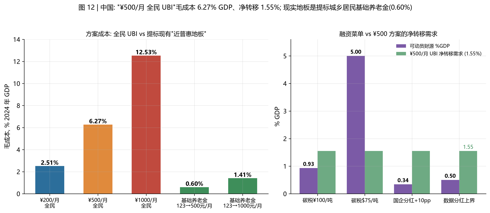

# 中国发 UBI 的可能性与财政问题
## ——"高信息化国家"系列的 china 专章（26 国样本之外的补充分析）

**研究日期**：2026-09-04 ｜ 上游：主报告 [UBI研究报告.md](UBI研究报告.md) · 子报告 [高信息化国家UBI可行性研究.md](高信息化国家UBI可行性研究.md) ｜ **数据**：`data/processed/11_china_ubi.csv`、`figures/fig12_china.png`，脚本 `scripts/12_china.py`

---

## 摘要

主研究把中国归入"中上收入、吃力但可议"组（$8.30/天 普惠毛成本 11.2% GDP），26 国高信息化样本未含中国。本章补齐，结论有三点意外：

1. **支付与身份轨道的"硬就绪度"全球第一梯队**：网络支付用户 10.29 亿（占网民 92.9%）、移动支付普及率 86%（央行口径，全球第一）、电子身份制度（网号/网证）2025 年施行、EGDI 0.8718（全球 #35，"非常高"组，较 2022 年升 8 位）。**发钱的技术管道比绝大多数中高收入国家更齐备**；真正的短板只有一个——农村老年群体（60 岁以上互联网使用率 52%）。
2. **中国有自己的"准 UBI 壳"**：城乡居民基本养老保险的实际领取者 1.804 亿人，中央基础养老金最低标准 2024 年 7 月起 123 元/月（2025 年 143 元、2026 年起 163 元，连续两年各 +20 元）——这就是一个现成的、近普惠、按月、数字化发放的现金地板。**把它提到 500 元/月，年成本仅 0.60% GDP**；而新建 ¥500/月 全民 UBI 要 6.27%。**"中国式 UBI"的第一步大概率不是新制度，而是旧制度提标。**（校验注：2026 年政府工作报告已将最低标准再提至 163 元/月；若以 163 元为基线，提标至 500 元的年成本降至约 0.55% GDP。）
3. **中国是少数"碳税量级够付 UBI 净转移"的大国**：¥500/月 方案的净转移需求约 1.62% GDP（比例税回收基准，Gini=0.36）；碳价按国际建议的 $75/吨测算，中国 12.6 Gt 排放可动员 **5.0% GDP**——即便按现实碳价 100 元/吨（0.93%）加国企分红提标 10pp（0.34%），组合也能覆盖净转移需求的约 80%。

**约束排序（与富国不同）**：中国发 UBI 的瓶颈既不是数字管道（已解决），也不是净成本量级（1.6% GDP 可组合覆盖），而是——**① 央地财政结构与户籍绑定的福利体制（全民给付天然绕开户籍，但资金由谁出、事权如何划分是新问题）；② 养老金体系的既有缺口（精算预测城镇职工养老保险累计结余 2027 年见顶 6.99 万亿、2035 年前后可能耗尽，延迟退休改革后修订至 ~2044）；③ 低水平"地板优先"与高成本"全民普惠"之间的路径选择。**

---

## 1. 数字就绪度：全球最深的支付管道

| 维度 | 数值（核验来源见 [facts_china_verified.md](sources/facts_china_verified.md)） | 对比 |
|---|---|---|
| 网络支付用户 | **10.29 亿**（2024.12，占网民 92.9%） | CNNIC 第 55 次报告 |
| 移动支付普及率 | **86%**（央行口径，全球第一） | 个人银行账户拥有率 >95% |
| 网民规模 | 11.08 亿 / 78.6%（2024.12）；农村 69.2%（2025.6） | WDI/ITU 口径为 92%（口径差异：ITU 含任何设备上网） |
| 数字政府 EGDI 2024 | **0.8718，全球 #35**（"非常高"组；2022 年 #43，升 8 位） | UN EGOVKB |
| 电子身份 | 网号/网证 2024 年 7 月征求意见、**2025 年施行**（"可用不可见"）；社保卡持卡超 13 亿 | 公安部/网信办 |
| 银发群体 | 60 岁以上网民 1.61 亿，互联网使用率 52% | CNNIC——**唯一短板维度** |

**判读**：与主研究 26 国样本相比，中国的支付轨道深度（10 亿级高频使用）超过所有样本国；短板与多数发展中国家相同——不是城市/系统，而是**农村与老年人的"最后一公里"**（农村互联网 69.2% vs 城镇 >85%；60+ 使用率 52%）。但主研究的跨国证据表明这类差距以"年"为单位收敛（My Number 四年 17%→80%）。

**中国特色的"瞄准"问题**：高信息化国家的福利瞄准靠算法与家计调查（荷兰/澳洲翻车案例见子研究 §2），**中国的福利分配却主要绑在户籍与统筹层级上**——城乡居民养老金的地域差、医保的属地化。全民现金给付天然绕开户籍识别问题（中央财政直达个人账户），这使 UBI 在中国语境下反而比现有"定向-属地"体系**少一层治理风险**；2020-2022 年防疫码则从正反两面证明了 14 亿人级数字触达能力与"紧急授权须有法律边界、须可申诉"的制度前提。

## 2. 方案成本：¥500/月是一个"大而可行"的方案



| 方案 | 毛成本 | % 2024 GDP | 含行为反应 +15% | 净转移 %GDP（k=0.259，Gini=0.36） | 相当于农村/城镇人均可支配收入 |
|---|---|---|---|---|---|
| ¥200/月·全民 | 3.38 万亿 | **2.51%** | 2.88% | 0.65% | 11.1% / 4.6% |
| ¥500/月·全民 | 8.45 万亿 | **6.27%** | 7.21% | **1.62%** | **27.7% / 11.6%** |
| ¥1000/月·全民 | 16.91 万亿 | **12.53%** | 14.41% | 3.25% | 55.3% / 23.2% |
| 基础养老金 123→500 元/月（1.8 亿领取者） | 0.82 万亿 | **0.60%** | — | — | 提标后 500 元 ≈ 农村养老金领取者收入倍增 |
| 基础养老金 123→1000 元/月 | 1.90 万亿 | **1.41%** | — | — | — |

**三点判读**：

- **分配指向天然偏农村**：¥500/月 等于农村人均可支配收入（2023 年 21,691 元）的 27.7%，却只占城镇（51,821 元）的 11.6%——同样一笔钱，农村相对受益强度是城镇的 2.4 倍。在城乡收入比仍约 2.4:1 的今天，普惠现金是中国语境下**少有的"自动再分配"工具**。
- **相对水平并不激进**：¥500/月 仅为人均 GDP 的 6.3%（α=6.3%），远低于芬兰实验的相对水平（€560 ≈ 中位收入 ~25%）与主研究 26 国的 α=20% 情景。它是一个"地板方案"而非"充分 UBI"；α=20% 需要 ¥1600/月 → 12.5% GDP 毛成本。
- **"壳"已经存在**：城乡居民基本养老保险覆盖 5.38 亿参保、1.80 亿领取者，按月、直达个人账户、全国最低标准统一——把 123 元提标到 500 元只需 **0.60% GDP**，是全球所有"类 UBI"选项中性价比最高的一条路径（对比：主研究中消除 $3.00 贫困缺口全球净成本 0.16% 世界 GDP，中国内部对应的就是这一地板）。

## 3. 财政问题：老龄化缺口与融资菜单

**老龄化与养老金既有缺口**：65+ 占比 14.7%（2024，WDI），联合国预测 2050 年约 30%（中方案约值）；社科院《中国养老金精算报告 2019-2050》预测城镇职工基本养老保险**2028 年当期赤字、累计结余 2027 年见顶 6.99 万亿、2035 年前后可能耗尽**（延迟退休与全国统筹改革后，后续研究把耗尽时点修订至 ~2044）。这意味着：**中国养老金体系自身就在排队等钱**，UBI 议题必须与"养老金缺口"同场竞标，且城乡居民的极低待遇（123 元）正是同一场危机的另一半。

**融资菜单（对 ¥500 方案净转移需求 1.62% GDP）**：

| 菜单 | 可动员量 | 评价 |
|---|---|---|
| 碳税 ¥100/吨（现实价：2024 全国碳市场 69.67-106.02 元/吨） | **0.93% GDP** | 现实起步价 |
| 碳税 $75/吨（国际建议价） | **5.00% GDP** | 中国是全球少数碳税"量级够"的大国（排放 12.6 Gt）；覆盖净转移需求 3 倍 |
| 国企利润上缴比例 +10pp | 0.34% GDP（2023 国企利润 4.63 万亿 × 10%） | 国资划转社保已有先例（1.68 万亿） |
| "数据分红"上界 | ≤0.5% GDP | 同子研究：单独永远不够 |
| 反向约束 | 土地出让收入 2021 年峰值 ~8.7 万亿 → 2024 年 ~4.9 万亿 | 结构性收入下滑，挤压而非释放预算空间 |

**组合结论**：现实碳价 + 国企分红 ≈ 1.3% GDP，已覆盖 ¥500 方案净转移需求（1.62%）的约 80%；若碳价向国际水平收敛，则完全覆盖且有富余。**中国 UBI 的财政可行性关键变量是碳定价力度，而非所得税**——这与高信息化国家（靠所得税加征 0-4pp）的路径截然不同。

## 4. 先例与判读

**华人社会已有准实验**：澳门现金分享计划自 2008 年起每年发放，2024 年度为永久居民每人 1 万澳门元（~68.7 万人），2025 年起新增"183 天居澳"条件；香港 2020 年现金发放计划向 ~700 万永久居民每人发放 1 万港元（约 711 亿港元）。两者证明：中文治理语境下大规模普惠现金在行政上完全可行；澳门的"居澳条件"调整也演示了"普惠如何被慢慢加上定向条件"。

**综合判读（约束强度排序）**：中国发 UBI 的约束排序是——**① 央地财政结构与资金归集（全民给付要求中央直达，绕开统筹层级）＞ ② 养老金既有缺口的预算排队 ＞ ③ 路径选择（提标地板 0.6% vs 新建普惠 6.3%）＞ ④ 数字管道（已解决）**。

最现实的路径判断：**"地板优先"**——先以 0.60% GDP 把城乡居民基础养老金提到 500 元/月（1.8 亿老年人口直接翻两番以上），再讨论全年龄扩展。这与主研究的全球结论呼应：UBI 的约束从来不是生产率，而是分配的政治学与治理的工程学——在中国，两者都有现成的制度接口。

## 5. 数据与局限

- 中国 Gini 取 WDI 2022 年值 36.0（官方口径）；净转移模型沿用主研究的对数正态法。
- WDI 互联网口径（92%，ITU）与 CNNIC 口径（78.6%）定义不同（前者含任何设备间歇上网），两者均列出。
- 基础养老金提标成本按中央最低标准测算，未计地方加发部分（各省实际标准普遍高于 123 元，如上海 ~1400 元），故实际提标成本会高于 0.60%；该测算回答的是"中央财政的边际成本"。
- 城乡居民/城镇职工人均可支配收入为 2023 年国家统计局数。
- 未建模：劳动供给行为反应的城乡异质性、UBI 对农民工流动与户籍改革的交互、人民币计价的通胀渠道。

## 6. 复现

```bash
python scripts/12_china.py    # 计算 + 图 12
```
核验事实：[sources/facts_china_verified.md](sources/facts_china_verified.md)；上游方法与文献库同主报告与子报告。
