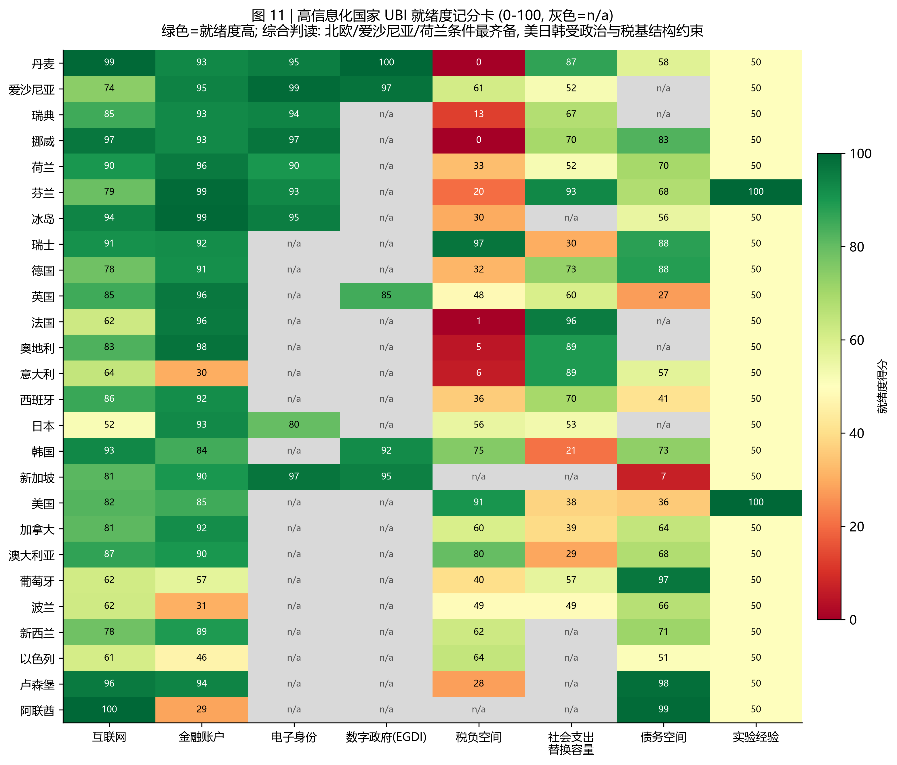
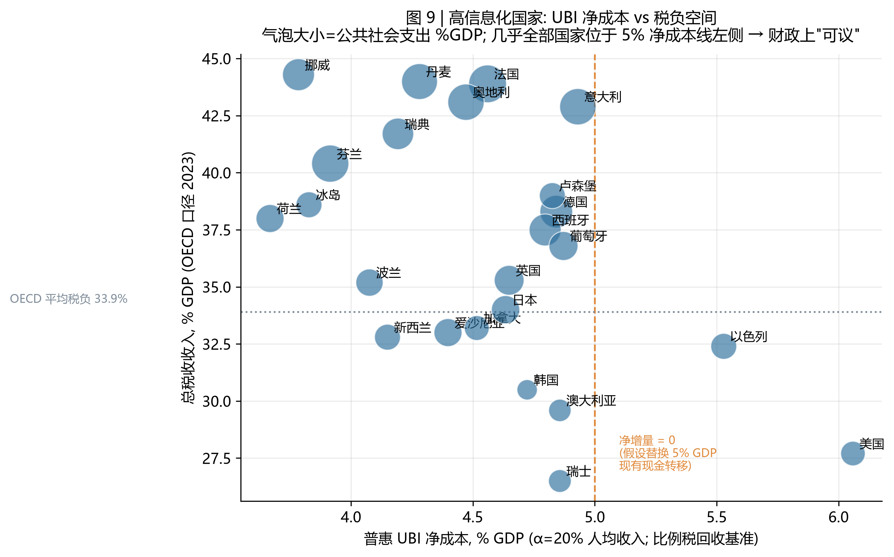
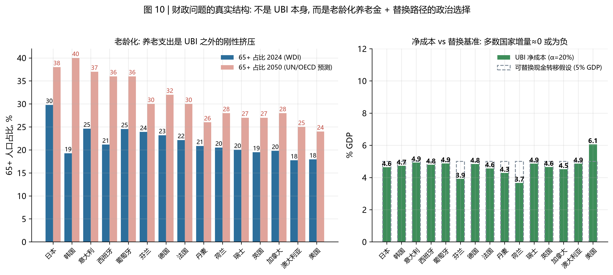

# 高度信息化国家发 UBI 的可能性与财政问题
## ——26 国数字就绪度 × 财政空间的系统评估（子研究）

**研究日期**：2026-09-04 ｜ **主报告**：[UBI研究报告.md](UBI研究报告.md)（全球与国家总量分析）｜ **本文数据**：`data/processed/08-10` 号表 + `analysis_digital_log.txt`，全程可复现

---

## 摘要

本文在主研究（结论：全球生产率总量早已足够 UBI，约束在分配与治理）基础上，聚焦一个更具体的问题：**对数字基础设施最发达的一批国家，UBI 的"最后一公里"已经打通了吗？剩下的是不是纯粹的财政问题？**

**核心发现：**

1. **技术条件在"头部国家"已经解决。** 26 国样本中，互联网普及率 85.5-100%、成人账户拥有率 86-99.9%、电子身份渗透率最高 99%（爱沙尼亚）、数字政府指数（UN EGDI 2024）前列几乎全在样本内。发钱的技术链条（身份→账户→支付→申诉）在高信息化国家**不再是可行性瓶颈**——日本 My Number 卡从 17%（2020）推进到 ~80%（2024）用了四年，证明即便"后进"国家追赶速度也以年计。

2. **但高度信息化 ≠ 免疫治理失败。** 荷兰 toeslagenaffaire（2.6 万家庭被风险算法误判为欺诈，吕特内阁 2021 年总辞）与澳大利亚 Robodebt（违法追债、A$18 亿和解、皇家委员会定性"可耻的失败"）证明：**最数字化的国家在"定向审查"上照样翻车**。这反过来构成 UBI 的治理论点——全民性免资格审查，恰好消除了算法定向的排斥与歧视风险。**UBI 不是治理技术的负担，而是治理技术的减负方案。**（严谨的表述是：它取消的是"资格审查类错误"这一风险源；身份欺诈与财政成本的风险并未消失，问题只是从"甄别谁合格"转移为"确认你是谁"。）

3. **财政量级："可议"，不是"不可负担"。** 一份等于 20% 人均收入（约等于多数样本国家的相对贫困线水平）的普惠 UBI：毛成本 20% GDP，比例税回收后**净成本仅 3.8-6.1% GDP**（低不平等的北欧 ~3.8-4.3%，美国 6.1%）。若替换 5% GDP 的现有现金转移，**欧洲、日本、韩国的增量≈0 或为负**（-0.1 至 -1.3pp），只有美国（+1.1pp）、以色列（+0.5pp）需要真正的新钱。

4. **真正的财政问题是结构性的：老龄化 + 替换政治，不是 UBI 本身。** 韩国 65+ 占比将从 19.3%（2024）升至 ~40%（2050，OECD 口径赡养比升 3.5 倍）、日本升至 ~38%、意大利/葡萄牙/西班牙 36-37%——养老金支出是 UBI 之外更大的刚性项。且替换现金转移在政治上极难（OECD 2017 模拟证明替换式 UBI 会使部分低收入者变差，触发 Korpi-Palme"定向悖论"）。**"发得起"与"发得政治正确"之间隔着养老金和既得利益。**

5. **融资菜单没有免费午餐**：碳税 $75/吨只值 GDP 的 0.3-1.8%；"数据分红"的理论上界（100% 征收全球数字广告利润）仅 ~0.4-0.65% 世界 GDP——**AI/数据红利单独供不起任何有意义的 UBI**；可行组合只能是"所得税加征 0-4pp + 替换 + （北欧模式）主权基金收益"。

**一句话结论**：高信息化国家发 UBI，**技术上今天就发得出去（爱沙尼亚/新加坡/北欧的支付管道已 97-99% 就绪），财政上发得起 4-6% GDP 的净成本，真正卡住的是三件政治经济学的事——养老金挤压下的预算排队、替换现有福利的既得利益、以及瑞士公投（76.9% 否决）式的合法性确认。**

---

## 1. 样本与口径

**"高度信息化国家"的操作化定义**：UN EGDI 2024 全球前列 + 互联网普及率 >85% + 成人账户拥有率 >85%。入选 26 国/地区：北欧（丹麦、瑞典、挪威、冰岛、芬兰）、波罗的海（爱沙尼亚）、西欧（荷兰、瑞士、德国、法国、英国、奥地利）、南欧（西班牙、意大利、葡萄牙）、亚太（日本、韩国、新加坡、澳大利亚、新西兰）、北美（美国、加拿大）、中东欧（波兰）、中东（以色列、阿联酋）、微型国家（卢森堡）。

**UBI 水平口径**：α × 人均GDP(PPP)，α ∈ {10%, 20%, 30%}。α=20% 约等于多数样本国家的"体面生存线"（相对贫困线通常为中位收入的 40-60%，UBI 20% 均值 ≈ 中位收入的 ~25%，接近芬兰 Kela 实验的 €560/月相对水平）。由恒等式，**毛成本 = α = 20% GDP**（与增长率、国家无关）；财政分析全部在**净成本**层面进行：净成本 = k(Gini) × 毛成本（对数正态-Gini 校准，见主报告 §3.5）。

## 2. 数字就绪度：技术链条已经就位

| 维度 | 样本范围 | 头部表现（核验值） |
|---|---|---|
| 互联网普及 | 85.5%（日本）- 100%（阿联酋） | 丹麦 99.8%、挪威 99.0%、卢森堡 98.8% |
| 成人账户拥有 | 86%（意大利，2017 年值）- 99.9%（冰岛） | 芬兰 99.8%、奥地利 99.5%、英国 99.3% |
| 电子身份 | 80%（日本 My Number）- 99%（爱沙尼亚） | 挪威 BankID ~97%、新加坡 Singpass 97%（15+）、瑞典 BankID ~94%+ |
| 数字政府（EGDI 2024） | 丹麦 0.9847（#1） | 爱沙尼亚 0.9727（#2）、新加坡 #3、韩国 #4、英国 #7 |

日本是唯一的"追赶"案例：My Number 卡 2020 年仅 ~17%，数字厅强推后 2024-25 年突破 1 亿张（~80%）——**数字身份渗透率的提升速度以"年"为单位，不构成十年尺度的可行性约束**。意大利的账户与以色列/波兰的账户率（86-89%）为 Findex 旧年份值（2017/2021），实际已更高。

**治理反转论点**：主研究已证明（发展中国家证据）定向审查带来 2-6% 的排斥率；本研究的两个高信息化国家案例表明排斥风险与数字化程度无关，而与**定向设计**有关——
- **荷兰 toeslagenaffaire**：税务署自学习风险算法把"双重国籍/外国姓名"当欺诈信号，2.6 万家庭被错误追债，>1,000 儿童进入寄养，2021 年 1 月吕特内阁集体总辞（Amnesty 称之为 "Xenophobic Machines"）；
- **澳大利亚 Robodebt**：以"收入平均化"算法向福利领取者追债，被判违法，A$18 亿集体诉讼和解 + 2023 皇家委员会定性"可耻的失败" + 2025 年追加 A$4.75 亿和解。

两者的共同点：**算法定向福利在大规模应用时，错误成本由最无议价能力者承担**。UBI 的全民性（免资格审查、免风险评分）在治理上等价于把这些风险从架构上移除——这是高信息化国家发 UBI 最被低估的有利论据。

## 3. 财政问题（一）：UBI 本身的量级——"可议"

α=20% 人均收入 UBI 的净成本（比例税回收基准，k = f(Gini)）：

| 组 | 国家（净成本 % GDP） |
|---|---|
| 低不平等（k≈0.19-0.23） | 挪威 3.8 · 冰岛 3.8 · 荷兰 3.7 · 芬兰 3.9 · 瑞典 4.2 · 丹麦 4.3 · 新加坡 4.1 · 新西兰/波兰 4.1 · 法国 4.6 · 日本 4.6 · 英国 4.6 · 加拿大 4.5 · 奥地利 4.5 · 德国 4.8 · 西班牙 4.8 · 瑞士/意大利/葡萄牙 4.9 |
| 高不平等（k≈0.24-0.30） | 爱沙尼亚 4.4 · 韩国 4.7 · **以色列 5.5 · 美国 6.1** |

**对照**：全部样本的净成本都在 OECD 平均税负（33.9%）的 1/6 以内；以"到丹麦水平（44%）的税负空间"衡量，除丹麦/挪威/法国/奥地利/意大利（<1.5pp 空间）外，样本有 2-17.5pp 的税负余量。**结论：UBI 净成本对高信息化国家是"一次重大预算重构"的量级（4-6% GDP），不是"财政不可承受"的量级。**

## 4. 财政问题（二）：替换的政治学——真正的博弈场

替换 5% GDP 的现有现金转移后，α=20% UBI 的**增量净成本**：

| 增量 | 国家 |
|---|---|
| **≈0 或为负**（-1.3 至 -0.1pp） | 荷兰 -1.3 · 挪威 -1.2 · 冰岛 -1.2 · 芬兰 -1.1 · 瑞典 -0.8 · 新西兰/新加坡 -0.9 · 波兰 -0.9 · 加拿大 -0.5 · 奥地利 -0.5 · 法国 -0.4 · 日本 -0.4 · 英国 -0.4 · 爱沙尼亚 -0.6 · 西班牙 -0.2 · 德国 -0.2 · 卢森堡 -0.2 · 葡萄牙 -0.1 · 瑞士 -0.1 · 澳大利亚 -0.1 · 意大利 -0.1 |
| **需新钱** | 美国 +1.1 · 以色列 +0.5 |

**这组数字的诱惑与陷阱**：它似乎说明欧洲可以"预算中性"地转向 UBI。但 OECD（2017）静态模拟与 Korpi-Palme 悖论早已警告：**替换式 UBI 必然打破现有定向体系的精细设计**——把按家计调查的补贴改成普惠，部分最贫困家庭（领取多重补贴者）绝对收入会下降，而中产阶级净受益，政治联盟因此撕裂。芬兰实验后政府止步于"失业者基本收入"（预算可控但不再普惠）、瑞士公投 76.9% 否决（2016）、安大略 2018 年取消已运行的试点——**替换问题的本质是"谁的补贴被砍"的政治问题，不是会计问题**。

## 5. 财政问题（三）：老龄化挤压与融资菜单

**老龄化是 UBI 之外更大的刚性项**：日本 65+ 占比 29.8%（2024）→ ~38%（2050）；韩国 19.3% → **~40%**（OECD 口径赡养比 20%→70-78%，工作年龄人口 2024-2050 缩减 ~25%，为 OECD 最快）；意大利 24.6→37、葡萄牙 24.5→36、西班牙 21.1→36。**养老金支出（占 GDP 的 7-16%）无法被 UBI 替换**——UBI 若与养老金叠加则总支出上升，若覆盖养老金则涉及代际契约重写。这决定了：**老龄化最快的高信息化国家（日、韩、意、西），恰恰是 UBI 财政窗口最窄的**——不是 UBI 贵，是排队在 UBI 前面的支出更刚性。

**融资菜单量化**（以 α=20%、替换后增量需求为准）：

| 菜单 | 可动员量（样本实测/核验） | 评价 |
|---|---|---|
| 所得税/总税负加征 | 增量本身 0-1.1pp GDP（欧日韩≈0）；税负空间 2-17.5pp | 主力选项；丹麦已无空间（44% 全球最高），瑞士/韩国/澳大利亚空间最大 |
| 碳税 $75/吨CO₂ | 冰岛 1.08 · 爱沙尼亚 1.10 · 阿联酋 2.17 · 加拿大 1.68 · 澳大利亚 1.77 · 美国 1.43 · 韩国 1.54 · 日本 1.23 · 德国 0.82 · **丹麦/法国 0.5** | 只能是配角 |
| "数据分红"/AI 红利税 | 全球数字广告总盘 ~$443-740B ≈ **0.4-0.65% 世界 GDP（100% 征收上界）** | **神话破除：单项永远供不起 UBI** |
| 主权财富基金 | 挪威 GPFG $2.1 万亿（3% 财政规则≈政府预算的 ~10%+，但规则限定制内使用）；阿拉斯加 PFD ~$1,700/人/年 | 特定资源国特权，不可推广；挪威反而**不分红** |
| 资本/财富税 | 主研究： billionaire 2% 财富税 ≈ 全球极端贫困缺口；国内资本收入基数 40-48% GDP | 需国际协调（避税港泄漏 8-10% 家庭金融财富） |

## 6. 综合判读：谁最可能发？

| 梯队 | 国家 | 判读 |
|---|---|---|
| **条件最齐备**（技术 97-99% + 财政净成本 <4.5% + 税负空间充足 + 现金转移传统） | 丹麦、爱沙尼亚、瑞典、挪威、荷兰、芬兰、冰岛 | 任何一届政府技术上可在 18 个月内上线；芬兰已做完实验但主动止步——**缺的是动机而非能力** |
| **技术齐备、政治未过关** | 瑞士（公投 76.9% 否决）、法国/奥地利（税负已 43-44%，无加税空间）、德国（债务刹车） | 财政可议，合法性未解决 |
| **财政+老龄化双紧** | 日本（65+ 29.8%→38%，My Number 80%）、韩国（→40%，最快）、意大利、西班牙、葡萄牙 | UBI 排队在养老金之后；韩国的数字能力（EGDI #4）与老龄化速度形成最强反差 |
| **税基结构约束** | 美国（净成本 6.1% 最高 + 税负 27.7% 最低档 + 联邦政治碎片化）、以色列 | 但美国拥有最丰富的准 UBI 实验资产（阿拉斯加、CTC、OpenResearch） |
| **特例** | 新加坡（盈余+Singpass 97%，但意识形态选择 Workfare 而非普惠）、阿联酋（财富充裕、65+ 仅 1.8%，但 ~88% 外籍人口使"全民"名不副实） | 治理模式差异，非技术/财政约束 |

**可能性排序的机制总结**：高信息化国家发 UBI 的约束强度排序是——**政治合法性（公投/联盟）＞ 养老金挤压 ＞ 替换的既得利益 ＞ 税基结构 ＞ 技术就绪（≈已解决）**。技术与净成本这两个"硬"约束在头部国家已经松绑；剩下的全是"软"的——也因此更难。

## 7. 与主研究的衔接

主研究证明：全球层面 $8.30/天 普惠毛成本 12.3% 世界 GDP ≈ 现行全球社保；国家层面富国毛成本仅 3.5-5.6%。**本文把"富国 4-5% GDP"组拆开看了财政与治理的内部结构**，两个补充结论：① 富国组内部，净成本因不平等差异从 3.7%（荷兰）到 6.1%（美国）差出 65%——**不平等越低，UBI 越便宜（k 系数效应）**，UBI 财政本身是累进性的函数；② 高信息化国家的治理证据（荷兰/澳洲案例）与发展中国家证据（Aadhaar 排斥、GAO 欺诈）方向一致：**定向=风险，普惠=减负**，这使 UBI 成为数字治理文献中罕见的"技术乐观 + 制度保守"交汇方案。

## 8. 数据与方法说明

- **面板**：WDI（`data/raw/wdi_panel.csv` + `wdi_panel2.csv`，新增 20 国 × 15 指标），逐指标取最新年份；`08_digital_readiness.csv` 含各指标年份。
- **核验常数**：UN EGDI 2024、OECD Revenue Statistics 2024/2025、OECD SOCX、UN WPP/OECD 老龄化预测、e-estonia/新加坡 MDDI/BankID 官方渗透率——全部记录于 [sources/facts_digital_verified.md](sources/facts_digital_verified.md)。
- **净成本模型**：k(Gini) = E[(1−Y/μ)⁺]，LogN 校准；规模不变，对收入水平不敏感。
- **口径注意**：WDI 债务为中央政府口径（日本/新加坡数值偏低/偏高需按 IMF 全口径解读）；意大利账户 86% 为 2017 年 Findex 值；OECD 税负与美国 SOCX 为 2023/2022 年公布值。
- **复现**：`python scripts/09_fetch_extended.py && python scripts/10_analyze_digital.py && python scripts/11_figures_digital.py`

## 9. 参考文献（本文新增部分）

完整文献库见主报告与 [sources/references.md](sources/references.md)。本文新增关键来源：UN E-Government Survey 2024（EGDI）；OECD Revenue Statistics 2024/2025；OECD SOCX / Society at a Glance 2024；OECD *Working Better with Age: Korea*；UN World Population Prospects；e-estonia.com；新加坡 MDDI Singpass Factsheet；日本数字厅 My Number 统计；BBC/Guardian/Amnesty（toeslagenaffaire 与 Xenophobic Machines）；Royal Commission into the Robodebt Scheme (2023)；NBIM 挪威主权基金年报；dentsu Global Ad Spend Forecasts 2025。
